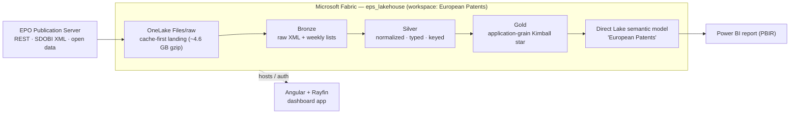

# European Patents on Microsoft Fabric

An end-to-end demo that ingests **European Patent Office (EPO)** publication data
into Microsoft Fabric, models it as a Kimball star, and serves it through a Direct
Lake Power BI report — with an Angular + Rayfin dashboard app as the frontend shell.
It shows a complete Fabric data-engineering story (medallion ingestion, deterministic
keys, explicit typing, validation gates, resumable loads) plus the reporting and app
layers that sit on top.

## Architecture



The data pipeline flows EPO → Bronze → Silver → Gold (star) → Direct Lake model →
Power BI report. The Angular app is a separate frontend shell hosted on Fabric via
Rayfin (it uses Fabric for auth/hosting, not for embedding the patents model).

## Repository layout

| Path | What it is |
|---|---|
| [`fabric/`](./fabric) | Fabric data backend + Direct Lake semantic model — ingestion notebook builder, medallion tables, and the TMDL model. See [`fabric/README.md`](./fabric/README.md). |
| [`powerbi/`](./powerbi) | Power BI report in PBIR format (`.pbip` + `.Report/`) over the Direct Lake model. See [`powerbi/README.md`](./powerbi/README.md). |
| [`src/`](./src) | Angular 21 dashboard app (standalone components, signals, lazy routes). |
| [`rayfin/`](./rayfin) | Rayfin service config + data schema for the app's backend. |
| [`workspace-sync/`](./workspace-sync) | Git-synced export of the live Fabric items (notebook, lakehouse, report, semantic model). Treat as generated output. |
| `manifest.json`, `angular.json`, `package.json` | App + Rayfin template configuration. |

## Data platform

A Fabric OneLake Lakehouse (`eps_lakehouse`) holds a Bronze/Silver/Gold medallion
build of EPO publications for **2010–2011** (104 weekly bulletins). Gold is an
**application-grain Kimball star** with deterministic `bigint` surrogate keys, explicit
column typing, and validation gates between layers. A **Direct Lake** semantic model
queries the Delta tables in place — no import copy.

Full detail — table row counts, grain, keys, typing rules, ingestion knobs, and known
limitations — is in [`fabric/README.md`](./fabric/README.md).

## Power BI report

A multi-page Power BI report (PBIR) bound to the Direct Lake **European Patents**
semantic model lives in [`powerbi/`](./powerbi). It is validated (0 errors); because
this tenant's Power BI ring rejects PBIR **API** import, publish it by opening
[`European Patents.pbip`](./powerbi/European%20Patents.pbip) in Power BI Desktop. See
[`powerbi/README.md`](./powerbi/README.md).

## App (Angular + Rayfin dashboard)

The frontend is a customer-facing dashboard built on **Rayfin** with an "Editorial Ink"
design system (dark ink palette, acid-lime accent, Fraunces display serif). It ships as
a reusable Project/Task dashboard shell — the layout you'd extend to surface patents
data — and is hosted on Fabric via Rayfin's Fabric auth provider.

- **Stack** — Angular 21 (standalone components, signals, lazy routes), Angular Material
  21 + CDK, chart.js + ng2-charts, and the `@microsoft/rayfin-*` SDK (auth, data, client)
  with the Fabric auth provider.
- **Two operating modes**, picked in the first-launch setup wizard:

  | Mode | Data source | UI writes |
  |---|---|---|
  | **Scratch** | Hand-created, seeded with demo projects/tasks | All CRUD enabled |
  | **GitHub-sync** | Issues + PRs from a public GitHub repo | Read-only (UI-only) |

- **Fabric linkage** — the app reads `VITE_FABRIC_WORKSPACE_ID`, `VITE_FABRIC_ITEM_ID`,
  and `VITE_FABRIC_PORTAL_URL` (mapped from the `__FABRIC_*__` tokens in `manifest.json`)
  to authenticate against its Fabric-hosted Rayfin backend. On a `localhost` API URL it
  falls back to a mock auth service for offline dev.
- **Scripts**

  ```bash
  npm run dev      # rayfin up + ng serve --port 5173
  npm run build    # production bundle in ./dist/
  npm run lint     # eslint
  npm test         # karma + jasmine (set CHROME_BIN if needed)
  ```

### Modes in depth

- **Scratch** — hand-managed CRUD via the UI; the wizard seeds two demo projects and a
  few tasks so the dashboard isn't empty on first paint.
- **GitHub-sync** — give the wizard a public `owner/repo`; the app validates it, pulls
  issues **and** PRs (`GET /repos/:owner/:name/issues?state=all`), and upserts each as a
  `Task` keyed by `uuidv5("${repo}#${number}")` so sync is idempotent and race-safe.
  "Sync now" is always available; the dashboard auto-syncs when the last sync is ≥ 24h old.
- **Switching modes** — Settings → **Reset to setup** wipes every project + task and
  returns to the wizard.

App caveats (UI-only read-only, public-repos-only sync, GitHub rate limits, on-load
"daily" sync) are inline in the source; see `src/app/services/` and `rayfin/data/schema.ts`.

## Getting started

Build the Fabric backend first, then run the app.

1. **Fabric backend** — follow [`fabric/README.md`](./fabric/README.md) to create
   `eps_lakehouse`, deploy and run the ingestion notebook, and deploy + refresh the
   Direct Lake semantic model.
2. **Power BI report** — open [`powerbi/European Patents.pbip`](./powerbi/European%20Patents.pbip)
   in Power BI Desktop and publish (see [`powerbi/README.md`](./powerbi/README.md)).
3. **App** — install and run the Angular dev server:

   ```bash
   npm install
   npm run dev
   ```

   Open [http://localhost:5173](http://localhost:5173) and complete the setup wizard.
   To target a Fabric-hosted backend, set the `VITE_FABRIC_*` environment variables
   described above.
