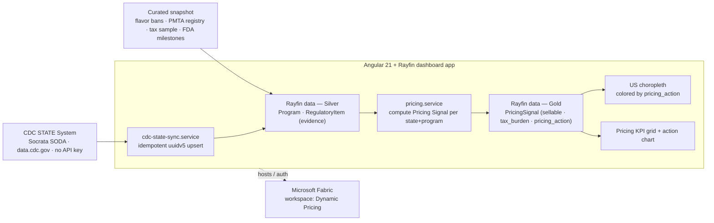

# PMI State Regulatory Monitor — Dynamic Pricing screen

A state-by-state **dynamic-pricing screening dashboard** for Philip Morris
International's smoke-free product lines — **ZYN** (nicotine pouches) and
**VEEV** (vapor / e-cigarette) as the pricing heroes, with **IQOS** (heated
tobacco) shown for federal context. Before PMI's dynamic-pricing engine sets a
shelf price in any US state, it must screen that state's live **tax + product
rules**. This dashboard turns 50 states of law into a per-state, per-program
**Pricing Signal** and colors a US map by the recommended **pricing action**.

It is a sibling of [`01-european-patents`](../01-european-patents) and reuses
that demo's entire app architecture — Angular 21 (standalone components,
signals, lazy routes) + Angular Material + chart.js/ng2-charts + the
`@microsoft/rayfin-*` SDK, the "Editorial Ink" design system, the list/detail +
KPI-grid + chart shell, and the two-mode setup wizard. The domain is reframed
(Project → **Program**, Task → **RegulatoryItem** = evidence law) and a
computed Gold **PricingSignal** serving table drives the whole UI. A live **CDC
STATE System** sync + an action-colored US map replace the GitHub sync +
bar-chart-only dashboard.

> **Additive-only + isolated workspace.** This is a second, independent demo.
> It lives entirely under `demos/02-pmi-state-regulatory-monitor/` (plus one row
> in the root README demos table) and never touches `01-european-patents`. It
> deploys to its **own** dedicated Fabric workspace, **"Dynamic Pricing"** — see
> [Deploy](#deploy--dynamic-pricing-fabric-workspace).

## Architecture



The app is a self-contained frontend shell. Both modes populate the **Silver**
`RegulatoryItem` evidence rows (live mode = CDC pull + curated ban/registry
facts; seeded mode = curated facts + a curated tax sample), then
`pricing.service` computes and upserts one **Gold** `PricingSignal` per
(state, program). The whole UI reads the Gold signals. The Rayfin backend uses
Fabric only for auth/hosting (a mock auth service is used for offline
`localhost` dev).

## Repository layout

| Path | What it is |
|---|---|
| [`src/`](./src) | Angular 21 dashboard app (standalone components, signals, lazy routes). |
| [`src/app/services/cdc-state-sync.service.ts`](./src/app/services/cdc-state-sync.service.ts) | Idempotent CDC STATE System sync (uuidv5 upsert), then curated-facts merge + Pricing Signal recompute. |
| [`src/app/services/pricing.service.ts`](./src/app/services/pricing.service.ts) | Pure `computeSignals()` + `PricingService.recompute()` — derives `sellable` / `tax_burden` / `pricing_action` per state+program and upserts the Gold `PricingSignal` rows. |
| [`src/app/services/constants.ts`](./src/app/services/constants.ts) | CDC dataset descriptors, category→program map, `PRICING_ACTIONS` (labels + map colors), curated ban/registry/tax seed layer, FDA milestones, US state names. |
| [`src/app/components/us-choropleth.ts`](./src/app/components/us-choropleth.ts) + [`src/app/data/us-states-paths.ts`](./src/app/data/us-states-paths.ts) | Inline-SVG US states choropleth colored by `pricing_action` (zero runtime map deps). |
| [`rayfin/`](./rayfin) | Rayfin service config + data schema (`Program` / `RegulatoryItem` / `PricingSignal` / `AppConfig`). |
| [`fabric/`](./fabric) | Microsoft Fabric medallion backend — Lakehouse + notebook + pipeline + Direct Lake semantic model (see [`fabric/README.md`](./fabric/README.md)). |
| [`powerbi/`](./powerbi) | Power BI report (PBIP/PBIR) — 3-page pricing dashboard over the Direct Lake model (see [`powerbi/README.md`](./powerbi/README.md)). |
| [`workspace-sync/`](./workspace-sync) | Git-synced exports of the deployed Fabric items (Lakehouse, Notebook, DataPipeline, SemanticModel). |
| `manifest.json`, `angular.json`, `package.json` | App + Rayfin template configuration. |

## Fabric backend

The dashboard also has a full **Microsoft Fabric** data-engineering backend that
computes the Pricing Signal server-side (mirroring the browser-side logic), deployed to
the dedicated **`Dynamic Pricing`** workspace:

- **Lakehouse** `pmi_lakehouse` — medallion Bronze → Silver → Gold Delta tables.
- **Notebook** `02_pmi_pricing_medallion` — PySpark port of `cdc-state-sync.service.ts`
  + `pricing.service.ts`; loads the 5 CDC datasets and computes `gold_pricing_signal`.
- **Pipeline** `pmi_pricing_pipeline` — runs the notebook on a daily schedule.
- **Semantic model** `PMI Dynamic Pricing` — Direct Lake star over the Gold tables.

Reconciles with the app: **3,941** normalized CDC rows, **57** pricing signals (VEEV 51,
ZYN 6) across **51** states, avg tax burden ~**24.2%**. See
[`fabric/README.md`](./fabric/README.md) for the full architecture, table lists, and
build/deploy steps.

## Power BI report

A 3-page Power BI report (PBIP/PBIR) sits over the **PMI Dynamic Pricing** Direct
Lake model as a pricing-decision dashboard: **Pricing Overview** (KPI cards + a US
filled map coloured by `pricing_action`), **Tax & Margin** (states by excise
burden; CO 62%), and **Compliance & Assortment** (State × Program matrix + gated
states). Bound `byConnection` to the model
(`semanticmodelid=6be9e165-…`), regenerated deterministically via
`node powerbi/pmi_report_gen.mjs`.

> Publish from **Power BI Desktop** (`PMI Dynamic Pricing.pbip` → Publish →
> Dynamic Pricing). This tenant's ring rejects PBIR **API** import (version-schema
> too new) — same limitation as the European Patents report. See
> [`powerbi/README.md`](./powerbi/README.md).

## Schema

The Rayfin data schema ([`rayfin/data/schema.ts`](./rayfin/data/schema.ts))
reframes the reference Project/Task shape:

- **Program** = a PMI product line (`product_code`: `IQOS` | `ZYN` | `VEEV`),
  with `name`, `description`, `created_at`, and many `RegulatoryItem`s. Seeded
  as three rows (IQOS / ZYN / VEEV).
- **RegulatoryItem** = one monitored state regulatory provision — the **Silver
  evidence** rows the signal is computed from. Fields: `title`, `state`
  (2-letter), `state_name`, `category`
  (`tax` | `youth_access` | `licensure` | `smokefree_air` | `preemption` |
  `flavor_ban` | `pmta_registry`), `status`
  (`enacted` | `pending` | `no_provision`), `provision_value`, `citation`,
  `enacted_date`, `effective_date`, `source_url`, `latitude`, `longitude`,
  `labels_json`, and a belongs-to `Program`. Federal FDA milestone rows use
  `state`/`state_name` = `US`/`United States`.
- **PricingSignal** = the computed **Gold serving** table the whole UI reads —
  one row per (`state`, `product_code`). Fields: `state`, `state_name`,
  `product_code`, `sellable` (bool), `tax_burden` (decimal %, optional),
  `pricing_action`
  (`price_freely` | `adjust_for_tax` | `delist_banned` |
  `restricted_assortment` | `watch_pending`), `recommendation` (one-line
  headline), the transparency flags `flavor_banned` / `registry_gated` /
  `has_pending`, `updated_at`, and a belongs-to `Program`. Deterministic id =
  `uuidv5("${state}#${product_code}", PRICING_NAMESPACE)` so recompute is
  idempotent.
- **AppConfig** = singleton, `sync_mode` (`pending` | `seeded` | `cdc`) +
  `last_synced_at`. No external repo is configured.

## Pricing Signal — the computed decision layer

After every load (seeded **or** live), [`pricing.service.ts`](./src/app/services/pricing.service.ts)
groups the Silver `RegulatoryItem` evidence by (`state`, `product_code`),
computes a signal, and upserts it to the Gold `PricingSignal` table. Inputs per
state+program:

- `flavor_banned` — an enacted `flavor_ban` item exists for the state. Only
  applies to flavored SKUs → **ZYN + VEEV** (IQOS heated tobacco is exempt).
- `registry_gated` — an enacted state-level `pmta_registry` item exists
  (federal `state=US` milestone rows are excluded).
- `has_pending` — any `pending` item exists for the state+program.
- `tax_burden` (%, decimal) — parsed from the state's `tax` item
  `provision_value`. A percentage is used directly; a **per-unit `$` value is
  converted to an approximate %** via an assumed reference retail price
  (`ASSUMED_ML_PER_PACK` × `$/ml` ÷ `ASSUMED_RETAIL_PRICE_USD`), flagged as an
  assumption in code and in [Caveats](#caveats). Null when the state has no tax
  row (e.g. ZYN — the CDC e-cig excise datasets don't cover pouches).

Stored outputs:

- **`sellable`** = `false` if `flavor_banned || registry_gated`, else `true`.
- **`pricing_action`** by precedence:
  1. `flavor_banned` → `delist_banned`
  2. `registry_gated` → `restricted_assortment`
  3. `has_pending` → `watch_pending`
  4. `tax_burden > 20%` → `adjust_for_tax`
  5. else → `price_freely`
- **`recommendation`** — the one-line headline shown on the state card, e.g.
  CO: *"Adjust for tax: 62% excise — raise price to protect margin"*; NJ:
  *"Delist: ZYN flavored SKUs banned in New Jersey"*; FL: *"Restricted
  assortment: sell only FDA-listed SKUs"*.

The US map is colored by `pricing_action` (green `price_freely`, amber
`adjust_for_tax`, blue `watch_pending`, orange `restricted_assortment`, rose
`delist_banned`). A program selector (ZYN / VEEV / IQOS) drives which program's
signals color the map; clicking a state opens the pricing-signal list filtered
to that state + program.

## Live data source — CDC STATE System (Socrata SODA)

The live sync pulls from **data.cdc.gov** (Socrata SODA API — **public, no API
key**). Endpoint pattern:
`https://data.cdc.gov/resource/{id}.json?$limit=1000&$order=year DESC` with a
descriptive `User-Agent`.

| Dataset id | Category | Row shape |
|---|---|---|
| `kwbr-syv2` | Excise tax | standard: `provisionvalue`, `citation`, `enacted_date`, `effective_date`, `geolocation:{latitude,longitude}` |
| `8zea-kwnt` | Youth access | standard |
| `ne52-uraz` | Licensure | standard |
| `piju-vf3p` | Preemption | standard |
| `wan8-w4er` | Smokefree indoor air | standard (non-summary): populated `provisionvalue` / `citation` / dates / `geolocation` Point |

> **Dataset fix.** The original smokefree-air **summary** dataset `i8t6-whzd`
> returns empty provision fields, so it is **dropped**. This demo uses the
> non-summary **`wan8-w4er`** ("CDC STATE System E-Cigarette Legislation —
> Smokefree Indoor Air") instead. Smokefree-air is not a pricing driver anyway;
> **tax + flavor_ban + pmta_registry** are the primary Pricing Signal inputs.

Sync rules ([`cdc-state-sync.service.ts`](./src/app/services/cdc-state-sync.service.ts)):

- **Idempotent upsert** — each row id is
  `uuidv5("${datasetId}#${state}#${provisionid}#${year}Q${quarter}", CDC_NAMESPACE)`,
  so re-syncs converge (no duplicates, race-safe).
- **Normalize** — each CDC row becomes a `RegulatoryItem`; bare-number tax
  rates are suffixed `%`, and `latitude`/`longitude` are extracted from the
  `geolocation` object.
- **Status** — `provisionvalue === 'No Provision'` → `no_provision`, else
  `enacted`.
- **Filter** to the 50 states + DC (drops territories and the national `US`
  row) and **dedupes to the most recent (year, quarter) per (state,
  provision)** so the map/KPIs reflect current law and the pull stays
  demo-fast (`$limit=1000` per dataset).
- **Category → Program** is a single editable lookup (`CATEGORY_PROGRAM`) — all
  CDC vapor legislation defaults to **VEEV**.
- **Merge + recompute** — after the CDC upsert the sync also loads the curated
  flavor-ban + PMTA-registry facts (CDC has no dataset for them), then calls
  `pricing.recompute()` so the Gold `PricingSignal` table is rebuilt from the
  fresh evidence.
- **Sync now** is available in Settings; the dashboard auto-resyncs when the
  last sync is ≥ 24h old.

## Curated / seeded layer

Well-documented, high-relevance items with no clean public API are hardcoded as
seed rows ([`constants.ts`](./src/app/services/constants.ts)) and loaded in
**seeded** mode (deterministic uuidv5 ids keep re-seeds idempotent):

- **Statewide flavor bans** (`flavor_ban`, enacted): CA, MA, NJ, NY, RI, UT —
  attached to **ZYN + VEEV** (pouches are often included).
- **PMTA registry / "directory" laws** (`pmta_registry`): AL, FL, KY, LA, NC,
  OK, VA, WI, MS (enacted); **IA, UT** marked `pending` (court-challenged) —
  attached to **VEEV**.
- **Vapor excise-tax sample** (`tax`, enacted, VEEV) — a small illustrative set
  of state rates (e.g. CO 62%) so seeded mode can compute a full Pricing Signal
  without the live CDC tax pull. In live mode this comes from `kwbr-syv2`
  instead.
- **Federal FDA authorizations** as Program-level milestone rows (`state=US`),
  shown on the Program detail: IQOS MRTP 2.4 (2020) + IQOS 3 order (2022); ZYN
  PMTA (Jan 2025) + ZYN MRTP application (20 SKUs, under review).

## App

- **Stack** — Angular 21 (standalone components, signals, lazy routes), Angular
  Material 21 + CDK, chart.js + ng2-charts, and the `@microsoft/rayfin-*` SDK
  (auth, data, client) with the Fabric auth provider.
- **Pages** — Dashboard (pricing KPI grid + action-colored US choropleth +
  program selector + pricing-action chart + priority-signals feed + Programs
  strip), Programs list/detail (that program's pricing signals + FDA
  milestones), **Pricing signals** list/detail (search + program + action +
  state filters; honors `?state=XX&program=YY` query params set by clicking a
  map state; detail headlines the action + recommendation and lists the
  underlying evidence laws), Setup wizard, Settings.
- **Killer visual** — an inline-SVG US states **choropleth** colored by
  **`pricing_action`** (green `price_freely`, amber `adjust_for_tax`, blue
  `watch_pending`, orange `restricted_assortment`, rose `delist_banned`) for the
  selected program. Clicking a state opens the pricing-signals list pre-filtered
  to that state + program. A chart.js **states-by-pricing-action** bar chart
  sits alongside.
- **KPIs** — # states with a restricted/banned SKU · average excise tax burden ·
  # states with pending bills (pricing risk) · # SKUs needing a price change
  this quarter (actionable signals).
- **Two operating modes**, picked in the first-launch setup wizard:

  | Mode | Data source | UI writes |
  |---|---|---|
  | **Seeded snapshot** | Curated flavor-ban / PMTA-registry / tax-sample / FDA rows | All CRUD enabled |
  | **Live CDC sync** | CDC STATE System (Socrata SODA) + curated ban/registry facts | Read-only (UI-only) |

- **Fabric linkage** — the app reads `VITE_FABRIC_WORKSPACE_ID`,
  `VITE_FABRIC_ITEM_ID`, and `VITE_FABRIC_PORTAL_URL` (mapped from the
  `__FABRIC_*__` tokens in `manifest.json`) to authenticate against its
  Fabric-hosted Rayfin backend. On a `localhost` API URL it falls back to a
  mock auth service for offline dev.
- **Switching modes** — Settings → **Reset to setup** wipes every Program +
  RegulatoryItem + PricingSignal and returns to the wizard.
- **Scripts**

  ```bash
  npm run dev      # rayfin up + ng serve --port 5173
  npm run build    # production bundle in ./dist/
  npm run lint     # eslint
  npm test         # karma + jasmine (set CHROME_BIN if needed)
  ```

## Getting started

```bash
npm install
npm run dev
```

Open [http://localhost:5173](http://localhost:5173) and complete the setup
wizard — pick **Seeded snapshot** for the curated point-in-time dataset, or
**Live CDC sync** to pull state e-cigarette legislation from the CDC STATE
System. Local `localhost` dev uses mock auth and needs **no** Fabric workspace.

## Deploy — "Dynamic Pricing" Fabric workspace

This demo deploys to its **own** dedicated Fabric workspace, **"Dynamic
Pricing"** — **not** the European Patents workspace. Isolation is enforced two
ways: [`rayfin/rayfin.yml`](./rayfin/rayfin.yml) is a distinct item
(`id`/`name: pmi-state-regulatory-monitor`, no inherited `publishable_key`, no
EPO redirect URI), and the deploy targets the Dynamic Pricing workspace by GUID.

| Field | Value |
|---|---|
| Workspace name | **Dynamic Pricing** |
| Workspace GUID | `aa0aa5fa-e638-4e4a-a0a2-a6da3e515f05` |
| Capacity | `ddddda30-aaa3-47f5-bd11-73194639ea8b` |
| Rayfin item id | `4c9573ca-df6b-4b09-b7d4-94ccb437f744` |
| Live URL | https://avid-poppy-6efd266772-westus.webapp.fabricapps.net |

```bash
# authenticated once via the Rayfin CLI (az / Fabric token)
npx rayfin up --workspace-id aa0aa5fa-e638-4e4a-a0a2-a6da3e515f05
```

> **Use the GUID, not the name.** "Dynamic Pricing" contains a space, which
> breaks some Fabric/XMLA connectors when passed as a name — always target the
> workspace by its GUID. The first `rayfin up` regenerates this item's own
> `publishable_key`, writes this folder's gitignored
> `rayfin/.deployments.json` + `rayfin/.env`, and populates the `__FABRIC_*__`
> tokens (workspace id, item id, portal URL). The European Patents workspace
> (`5e0747bf-be6c-449b-b0cc-1911bd54577f`) is never touched.

## Caveats

- **CDC data is legislation tracking, not real-time enforcement.** The CDC
  STATE System records statute/rule status stamped by `year`/`quarter`; it does
  not reflect real-time enforcement, active litigation, or emergency
  rulemaking. Treat the stamped quarter as the as-of date.
- **The tax→% conversion is an assumption.** CDC excise rows expressed as a
  percentage are used directly; a per-unit `$`/ml value is converted to an
  approximate % via an assumed reference retail price
  (`ASSUMED_ML_PER_PACK` / `ASSUMED_RETAIL_PRICE_USD` in
  [`constants.ts`](./src/app/services/constants.ts)). The `>20%` "high tax"
  threshold that triggers `adjust_for_tax` is a demo heuristic — tune both for a
  real pricing model.
- **ZYN has no CDC excise data.** The CDC e-cig excise datasets don't cover
  nicotine pouches, so ZYN signals are driven by flavor-ban / pending status,
  not tax; VEEV carries tax + ban + registry.
- **The curated layer is a point-in-time snapshot.** The flavor-ban,
  PMTA-registry, tax-sample, and FDA-milestone lists were compiled as of
  **2026-07** and will drift as laws change. Re-date and revise them before
  reuse. IA and UT registry laws are flagged `pending` because they are
  court-challenged.
- **Browser-side sync only hits public, no-key endpoints.** The app calls only
  the CDC SODA API (no key, no other host). Socrata applies anonymous
  throttling, so pulls are capped (`$limit=1000` per dataset, deduped
  client-side to the most recent quarter per state/provision).
- **The Program ↔ category mapping is a demo heuristic.** All CDC vapor
  legislation is assigned to **VEEV** via a single editable lookup
  (`CATEGORY_PROGRAM`); the curated flavor-ban rows additionally attach to ZYN.
  Adjust the lookup to change program attribution.
- **The choropleth has no DC geometry.** DC has no map polygon, but its
  provisions still appear in the lists and KPIs.
