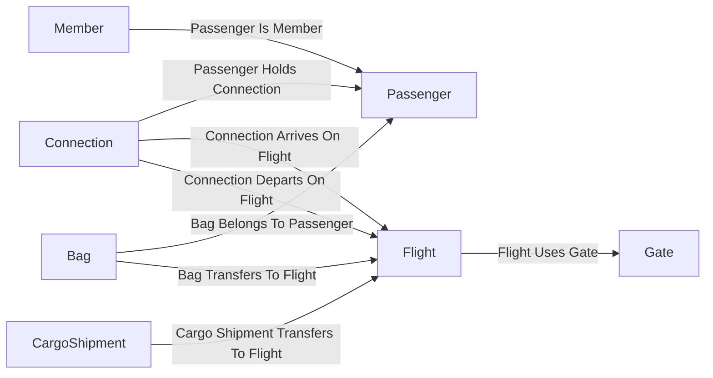

# The hub ontology

This is the shape the agents reason over. It turns the ten lakehouse tables into
seven entity types a person would name out loud, joined by eight relationships
that read like sentences, with the business rules written in plain language next
to them.

The ontology item lives in the workspace as `HubOntology`. Its definition is in
the repository under `fabric/workspace/HubOntology.Ontology/`, and
`fabric/deploy_ontology.py` publishes it.

## Entity types and relationships



### The seven entity types

| Entity type | Backed by | Key property | What it is |
| --- | --- | --- | --- |
| `Flight` | `flights` | `FlightId` | An arrival or a departure at the hub. Carries the live ETA as a time series. |
| `Gate` | `gates` | `GateIdentifier` | A gate and the concourse it sits in. |
| `Passenger` | `passengers` | `PassengerId` | A person on a flight. Holds no passport number and no phone number. |
| `Member` | `members` | `MemberNumber` | The loyalty record for a passenger, with the tier and its service benefits. |
| `Connection` | `bookings` | `BookingId` | One passenger moving from an inbound flight to an onward flight. |
| `Bag` | `bags` | `BagTag` | A checked bag that has to make the same move. |
| `CargoShipment` | `cargo_shipments` | `ShipmentId` | Freight transferring between the same two flights. |

`Connection` has no table of its own. It is the booking seen as a move, which is
the thing the demo actually talks about.

### The eight relationships

| Relationship | From | To | Backed by |
| --- | --- | --- | --- |
| `Passenger Holds Connection` | `Connection` | `Passenger` | `rel_bookings_passenger` |
| `Connection Arrives On Flight` | `Connection` | `Flight` | `rel_bookings_inbound_flight` |
| `Connection Departs On Flight` | `Connection` | `Flight` | `rel_bookings_onward_flight` |
| `Passenger Is Member` | `Member` | `Passenger` | `rel_members_passenger` |
| `Bag Belongs To Passenger` | `Bag` | `Passenger` | `rel_bags_passenger` |
| `Bag Transfers To Flight` | `Bag` | `Flight` | `rel_bags_onward_flight` |
| `Flight Uses Gate` | `Flight` | `Gate` | `rel_flights_gate` |
| `Cargo Shipment Transfers To Flight` | `CargoShipment` | `Flight` | `rel_cargo_onward_flight` |

Two of the underlying table relationships are inactive on purpose:
`rel_bookings_onward_flight` and `rel_bags_onward_flight`. A model may only have
one active path between the same pair of tables, and the inbound path and the
passenger path win. The entity relationship still names the inactive one, so the
onward leg is still a thing the agents can walk.

## The ETA time series

`Flight` has a property `EtaUpdates` of type `TimeSeries<dateTime>`. It is
ordered by `flight_events.event_time` and takes its value from
`flight_events.eta_local`.

The events arrive in the eventhouse. The ontology reads them from a lakehouse
copy of the same rows, written by `write_events_table` in
`src/hubdemo/generate.py` as `flight_events.parquet` and landed as the Delta
table `dbo.flight_events`.

The reason is in the definition format, not in the product. A TMDL partition has
exactly one mode, `directLake`, and there is no eventhouse or KQL partition mode
to write. Binding an entity to an eventhouse is something the portal agent does
for you; it is not something the item definition can say. Rather than invent a
mode, the Phase 6 prompt allows this fallback, and this is it. See V85 in
`docs/verify-list.md`.

## The business rules

The rules are not written into the ontology by hand. `fabric/deploy_ontology.py`
builds them from `scenario/qr004.yaml` at deployment time, so every minute in
every sentence comes from the scenario file and from nowhere else. Change the
scenario, deploy again, and the sentences change with it.

Each rule names the entity types and relationships it talks about, so a reader
can see which part of the graph a sentence applies to.

| Rule | What it says |
| --- | --- |
| `ConnectionWindow` | The window is the time between the inbound estimated arrival and the onward scheduled departure. A hold adds its minutes to the window. |
| `FastTrackOption` | The fast option sends the passengers through a fast track transfer and holds nothing. |
| `HoldOption` | The hold option holds the onward flight by at most the maximum hold, and fast tracks the passengers as well. |
| `RebookOption` | The rebook option moves the passengers to the next flight to the same city. |
| `OptionResult` | Spare time is the window minus the fast track minutes. At or above the margin it is ok, between zero and the margin it is risky, below zero it fails. |
| `BagsMakeIt` | A transfer bag makes it above the priority minutes with priority handling, and above the standard minutes otherwise. |
| `CargoMakesIt` | A shipment makes it above the cargo minutes. Temperature controlled freight is handled first. |
| `ConnectionAtRisk` | A connection is at risk when the window is below the time a standard transfer needs. |
| `ProposalChoice` | The proposal is the first of the fast option and the hold option whose result is ok, and rebook when neither is. |
| `TierService` | Tier never changes which option is proposed. It only adds service actions. |
| `ApprovalStageOne` | Every plan needs the first approver before anything is sent. |
| `ApprovalStageTwo` | A second approver is needed when the hold is too long, when a chosen option is risky or fails, or when a Platinum member is rebooked. |
| `ApprovalTimeout` | A plan that is not approved inside the timeout is dropped and nothing is sent. |

The same rules live as code in `src/hubdemo/rules.py`. The ontology carries the
words so a person and an agent read the same statement; the module carries the
arithmetic so the numbers are computed once.

## What is left out on purpose

`passengers` has a `passport_no` column and a `contact_phone` column. Neither is
a property of the `Passenger` entity type, and neither appears anywhere in the
ontology definition. An agent reasoning over the ontology cannot reach them. A
test asserts this, so it stays true.

`is_synthetic` is a table column with no property. It marks the data as made up
and is not part of the business language.

## Deploying it

```
python fabric/deploy_ontology.py --env demo --dry-run
python fabric/deploy_ontology.py --env demo
```

The dry run prints the plan, counts the definition parts and the generated
rules, and makes no network call. The live run creates the item if it is not
there, updates it if it is, then reads the definition back and reports any
difference in the parts it supplied. Running it twice in a row should report no
differences the second time.

Two addresses in `expressions.tmdl` are placeholders in the repository and are
filled in at deployment time from the workspace: the lakehouse SQL endpoint and
the lakehouse item id. They are not configuration keys, because they are
properties of a resource the script can already see.

## Building it in the portal instead

If the definition path is not available, the same ontology can be built by hand.
This is documented, not automated.

1. In the workspace, create a new **Ontology** item.
2. Choose **Get started**, then **Start with Ontology agent**.
3. Point the agent at the `lh_hub` lakehouse and work through **Discover**,
   **Draft**, **Validate** and **Apply**. The agent starts in plan mode, which
   is read only; it has to be switched to act mode before it changes anything.
4. Keep the ontology in the same workspace as its sources.
5. When it looks right, read the definition back into the repository with the
   item definition API so the two stay in step.

The agent can bind an entity to an eventhouse, which the definition format
cannot express. That is the one thing the portal path can do that this script
cannot.

## Querying it

An ontology can be queried four ways, depending on where the bound data lives:
KQL for an eventhouse, SQL for a lakehouse, DAX for a semantic model, and GQL to
walk the graph itself. This ontology is bound to the lakehouse, so SQL and GQL
are the useful two.
